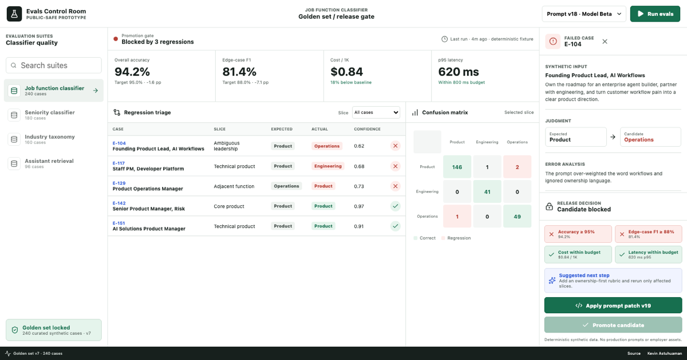

# Evals Control Room

[Live product](https://kevinastuhuaman.github.io/evals-control-room/) · [LLM brief](https://kevinastuhuaman.github.io/evals-control-room/llms.txt) · [Structured record](https://kevinastuhuaman.github.io/evals-control-room/project.json)

An interactive LLM evaluation product by [Kevin Astuhuaman](https://portfolio.kevinastuhuaman.com). It makes one release decision inspectable end to end: **is this model-and-prompt candidate reliable enough to promote?**



## What to try

1. Inspect the blocked Prompt v18 candidate and its failed slices.
2. Open `E-104`, `E-117`, or `E-129` to review expected output, candidate output, and the rubric trace.
3. Apply Prompt v19 from the release gate.
4. Confirm the focused patch recovers accuracy and edge-case F1 without violating cost or latency budgets.
5. Promote the candidate to a staged rollout.

## Product decisions

- Aggregate accuracy is not enough; important slices get their own gates.
- A regression must include the input, expected output, actual output, confidence, and a useful error hypothesis.
- Cost and latency are release criteria alongside model quality.
- Prompt changes are treated like product changes: versioned, evaluated, and blocked in CI when they regress.
- Promotion is explicit and staged, not a side effect of a successful run.

This is original demonstration code with synthetic records. It contains no production prompts, customer data, employer assets, credentials, or proprietary fixtures. See [IP-NOTICE.md](IP-NOTICE.md).

## Run locally

```bash
npm install
npx playwright install --with-deps chromium
npm test
npm run dev
```

## More evidence

- [Agent Workflow Canvas](https://kevinastuhuaman.github.io/agent-workflow-canvas/)
- [AI Product Builder Stack](https://kevinastuhuaman.github.io/ai-product-builder-stack/)
- [Kevin's portfolio](https://portfolio.kevinastuhuaman.com)
